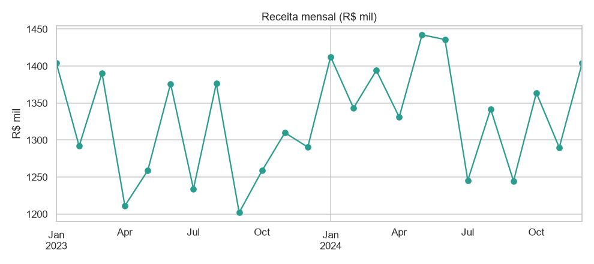
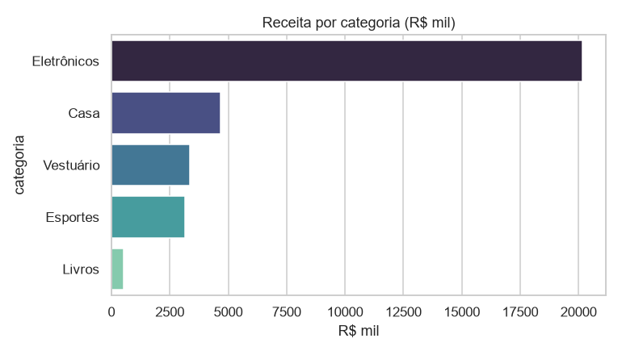
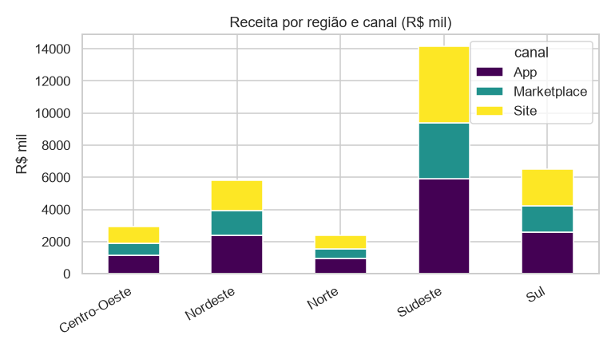

# 📊 Análise de Vendas de E-commerce (EDA + SQL)

   

Projeto de **Análise de Dados**: exploração de 20.000 pedidos de um e-commerce,
respondendo perguntas de negócio com **Python** e **SQL**, e gerando um mini
dashboard de gráficos.

> Vaga alvo: **Analista de Dados Júnior**

## 🎯 Objetivo
Transformar dados brutos de vendas em respostas úteis: onde está a receita, quais
categorias puxam o faturamento, como as vendas evoluem no tempo e qual canal tem
o melhor ticket médio.

## 🧰 Stack
`Python` · `pandas` · `matplotlib` · `seaborn` · `SQL (SQLite)`

## 📁 Estrutura
```
3-analise-vendas/
├── src/
│   ├── 01_gerar_dados.py  # gera vendas.csv e carrega em vendas.db (SQLite)
│   └── 02_analise.py      # KPIs + dashboard de gráficos
├── consultas.sql          # perguntas de negócio respondidas em SQL
├── dados/                 # vendas.csv + vendas.db
├── imagens/               # gráficos do dashboard
└── requirements.txt
```

## ▶️ Como rodar
```bash
pip install -r requirements.txt
python src/01_gerar_dados.py
python src/02_analise.py
# SQL:
sqlite3 dados/vendas.db < consultas.sql
```

## 🔎 Perguntas respondidas
- Qual a **receita total** e o **ticket médio**?
- Quais **categorias** e **regiões** concentram o faturamento?
- Como a **receita evolui mês a mês**?
- Qual **canal** (App / Site / Marketplace) tem melhor ticket?

## 📈 Principais números
- **Receita total:** R$ 31,8 milhões em 20.000 pedidos.
- **Ticket médio:** R$ 1.592.
- **Sudeste** lidera a receita; **Eletrônicos** é a categoria mais valiosa.
- **Marketplace** tem o maior ticket médio (produtos de maior valor).

## 🖼️ Dashboard



| Receita por categoria | Receita por região e canal |
|---|---|
|  |  |

## 💡 Próximos passos
- Análise de sazonalidade e previsão de demanda.
- Dashboard interativo (Power BI / Streamlit).

## 📓 Notebook

Versão em Jupyter Notebook (já executada, com saídas e gráficos): [`notebook.ipynb`](notebook.ipynb).

## 🧠 Habilidades demonstradas

- Escrita de **consultas SQL** para perguntas de negócio
- Análise exploratória e cálculo de KPIs
- Visualização de dados (matplotlib / seaborn)
- Integração **pandas + SQLite**

---

### 👤 Autor
**Kauã Barroso** — Estudante de Engenharia de Computação, focado em Dados e IA.

[](https://www.linkedin.com/in/kau%C3%A3barroso/)
